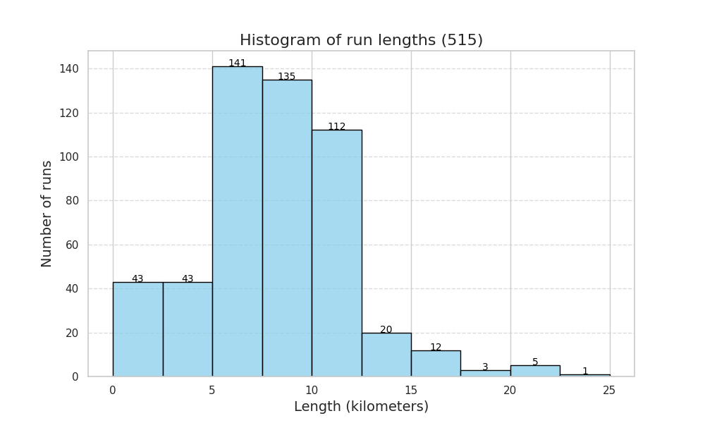
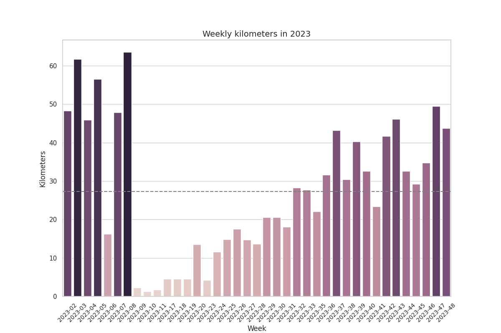

# Garmin Data Analysis

My motivation to create this repository was creating a bar chart race of running shows usage. Currently, it includes scripts for creating other charts like the distribution of run lengths or the summary of weekly kilometers in a year.

## Garmin Data

The scripts and utilities here provided are designed to work with the Garmin raw data exported from the [private data management area](https://www.garmin.com/es-ES/account/datamanagement/).

Therefore, you must request a data export before using these scripts and utilities. For convenience, I store such data in `garmin-data`, which is included in the `.gitignore` file.

## Setting up the virtual environment

Create a Python virtual environment for the project:

```
python3 -m venv .venv
.venv/bin/python3 -m pip install -r requirements.txt
```

In case of installing new dependencies, save them with:
```
.venv/bin/python3 -m pip freeze > requirements.txt
```

## Bar chart race creation

This involves two steps:
1. Processing the raw data to create a table where rows are the time snapshots and columns the running shows. This is done using the `collect_running_bar_chart_race_data.py` script.
2. Using such data to create the bar chart race using the `bar_chart_race` [package](https://github.com/dexplo/bar_chart_race). This is done using the 

To do so, call the scripts as follows:
1. `python3 collect_running_bar_chart_race_data garmin-data/<data-export-id> your@email.here garmin-data/<data-export-id>.csv`
2. `python3 make_bar_chart_race.py garmin-data/<data-export-id>.csv garmin-data/<data-export-id>.mp4`

A sample result video can be found [here](https://raw.githubusercontent.com/hlfernandez/garmin-data/master/docs/demo_bar_chart_race.mp4).

<video controls>
  <source src="https://raw.githubusercontent.com/hlfernandez/garmin-data/master/docs/demo_bar_chart_race.mp4" type="video/mp4">
</video>

## Distribution of run lengths

Creates a histogram with the distribution of the lengths of all running activities: `python3 run_length_distribution.py garmin-data/<data-export-id> your@email.here garmin-data/run_length_distribution_$(date -u +%Y.%m.%d).png`



## Summary of weekly kilometers in a year

Creates a histogram with the weekly kilometers in a given year: `YEAR=2023 && python3 summarize_weekly_kilometers_by_year.py garmin-data/<data-export-id> your@email.here garmin-data/weekly_kilometers_${YEAR}.png`


